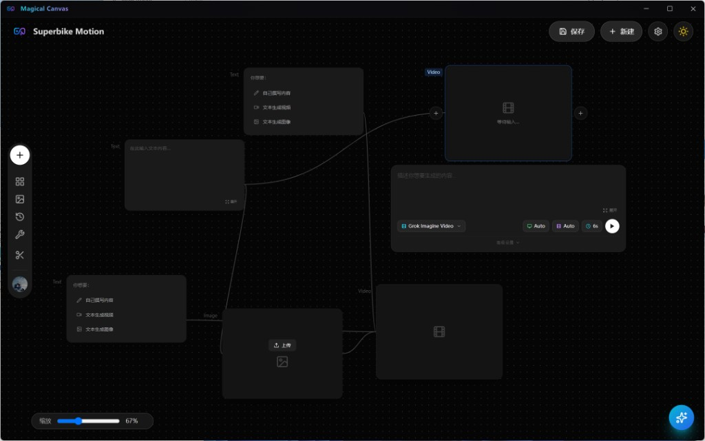
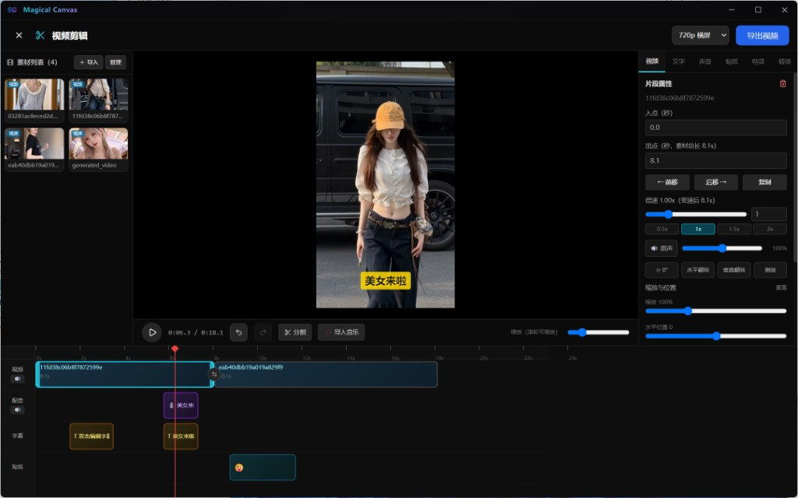

<div align="center">
  
  <h1>Magical Canvas</h1>
  <p><strong>AI 创作画布 × 视频剪辑工作室 —— 全中文、开箱即用的 Windows 桌面应用</strong></p>

  
  
  
  
  
  
</div>

---

**Magical Canvas** 是一款将「AI 内容生成」与「视频剪辑」融为一体的桌面创作工具：

- 在**节点画布**上以拖拽连线的方式编排文字 → 图片 → 视频的 AI 生成工作流；
- 在内置的**视频剪辑工作室**中完成剪辑、转场、字幕、配音、贴纸、特效与成片导出；
- 无需浏览器、无需命令行，下载即用，界面全中文。

> 本项目基于 [SankaiAI/TwitCanva-Video-Workflow](https://github.com/SankaiAI/TwitCanva-Video-Workflow) 二次开发（Apache-2.0），在其优秀的 AI 画布工作流之上进行了深度本地化与功能扩展，详见[与上游项目的差异](#-与上游项目的差异)。

## 界面预览

**AI 节点画布** —— 拖拽连线编排生成工作流：



**视频剪辑工作室** —— 多轨时间轴、字幕、配音、贴纸一站式成片：



## ✨ 功能特性

### 🎨 AI 节点画布

- **节点式工作流**：文本、图片、视频节点自由连线，类型感知校验（文本→图片、图片→视频等）
- **多模态生成**：文生图、文生视频、图生视频、首尾帧动画
- **统一模型配置**：文本 / 图片 / 视频 / 语音识别四类模型，均可在设置中自定义 API 地址、密钥与模型名，兼容任意 OpenAI 风格接口
- **工作流管理**：保存、加载、分享画布工作流
- **素材库**：生成结果自动入库，可随时复用
- **AI 聊天助手**：内置 LangGraph Agent 对话面板

### 🎬 视频剪辑工作室（类剪映体验）

- **多轨时间轴**：视频 / 配音 / 字幕 / 贴纸四轨编辑，拖拽排序、边缘裁剪、滚轮缩放、播放头拖动
- **片段属性**：变速（滑杆 + 数值）、音量 / 静音、倒放、旋转翻转、画面调节（亮度 / 对比度 / 饱和度）、缩放与位置
- **丰富转场**：数十种内置转场，支持单独 / 批量应用与实时预览
- **字幕系统**：自定义位置、字号、颜色、背景，8 种经典预设样式
- **智能字幕**：自动提取视频原声 / 配音轨语音并生成时间轴字幕（OpenAI 兼容 ASR 接口）
- **AI 配音**：文案一键转语音（微软 Edge TTS，多种中文音色，免费）
- **贴纸与特效**：内置表情贴纸与画面特效库
- **素材管理**：批量导入、**拖放文件导入**、多选删除、一键清空
- **快捷键**：复制 / 剪切 / 粘贴 / 删除 / 撤销 / 重做，右键上下文菜单
- **成片导出**：FFmpeg 本地合成（内置二进制，无需单独安装），720p / 1080p 横竖屏

### 🖥️ 桌面端体验

- **无边框窗口**：自绘标题栏与最小化 / 最大化 / 关闭按钮，深色一体化视觉
- **全中文界面**：所有界面、提示与对话框均为中文，统一风格的应用内弹窗
- **绿色便携**：提供安装版与便携版两种分发形态
- **数据本地化**：API 密钥与素材库存放于本机用户目录，密钥仅在本地后端使用，不经过任何第三方

## 🚀 快速开始

### 直接使用（推荐）

从 [Releases](https://github.com/28998306/MagicalCanvas/releases) 下载：

| 文件 | 说明 |
| --- | --- |
| `MagicalCanvas-安装版.exe` | 安装一次，之后秒开（推荐） |
| `MagicalCanvas-便携版.exe` | 免安装单文件，每次启动需解压、较慢 |

首次启动后，点击右上角 **设置** 填入你的模型 API 地址 / 密钥 / 模型名即可开始创作。

### 开发模式

```bash
# 环境要求：Node.js 18+
git clone https://github.com/28998306/MagicalCanvas.git
cd MagicalCanvas
npm install

# 同时启动前端 (Vite, :5173) 与后端 (Express, :3501)
npm run dev
```

### 构建与打包

```bash
# 构建前端产物
npm run build

# 打包 Windows 桌面应用（安装版 + 便携版，输出至 release/）
npx electron-builder --win
```

## 🧩 模型配置说明

所有 AI 能力均通过 OpenAI 兼容接口调用，可在「设置」中按类别独立配置：

| 类别 | 用途 | 接口形式 |
| --- | --- | --- |
| 文本模型 | 文案生成、聊天助手、配音脚本 | `POST /chat/completions` |
| 图片模型 | 文生图、图生图 | `POST /images/generations` 等 |
| 视频模型 | 文生视频、图生视频 | OpenAI 兼容视频接口 |
| 语音识别 | 智能字幕（语音转文字） | `POST /audio/transcriptions` |

每个类别均可分别填写 **API 地址、API Key、模型名**，保存后即时生效，无需重启。

## 🏗️ 技术栈

| 层 | 技术 |
| --- | --- |
| 前端 | React 18 · TypeScript · Vite · Tailwind CSS |
| 后端 | Node.js · Express（本地服务，托管 API 与静态资源） |
| 桌面 | Electron 33 · electron-builder（NSIS 安装版 + Portable 便携版） |
| 音视频 | FFmpeg（ffmpeg-static 内置）· msedge-tts 语音合成 |
| AI 接入 | OpenAI 兼容 REST 接口（文本 / 图片 / 视频 / ASR） |

## 🔀 与上游项目的差异

本项目自 [TwitCanva-Video-Workflow](https://github.com/SankaiAI/TwitCanva-Video-Workflow) 派生，主要改动：

- ✅ **新增完整的视频剪辑工作室**：多轨时间轴、转场、字幕（含智能字幕）、AI 配音、贴纸特效、变速倒放、成片导出等
- ✅ **全中文本地化**：界面、提示、对话框全面翻译，统一应用内弹窗样式
- ✅ **桌面化**：Electron 无边框窗口、自定义标题栏、应用图标、安装版 / 便携版打包
- ✅ **统一模型配置**：以「文本 / 图片 / 视频 / 语音识别」四类通用 OpenAI 兼容配置取代原有的多家直连提供商设置
- ✅ **素材库增强**：批量导入、拖放导入、多选删除、清空
- ➖ **移除社交发布能力**：去除了发布到 X (Twitter)、TikTok 导入 / 发布等功能，专注本地创作

## 🤝 致谢

- [SankaiAI/TwitCanva-Video-Workflow](https://github.com/SankaiAI/TwitCanva-Video-Workflow) —— 本项目的上游基础，提供了出色的 AI 画布工作流架构
- [FFmpeg](https://ffmpeg.org/) · [msedge-tts](https://github.com/Migushthe2nd/MsEdgeTTS) · [Electron](https://www.electronjs.org/) · [Lucide Icons](https://lucide.dev/)

## 📄 许可证

本项目沿用上游的 [Apache License 2.0](LICENSE) 开源协议发布，并依据协议要求保留了原始 [NOTICE](NOTICE) 文件、对修改内容作出声明。

使用本软件产生的 AI 内容请遵守所接入模型服务商的使用条款及当地法律法规。
